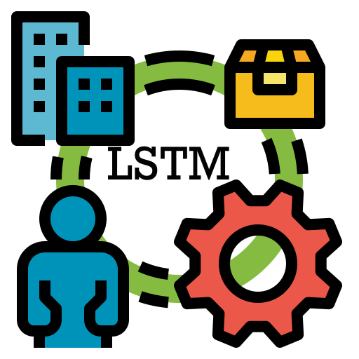
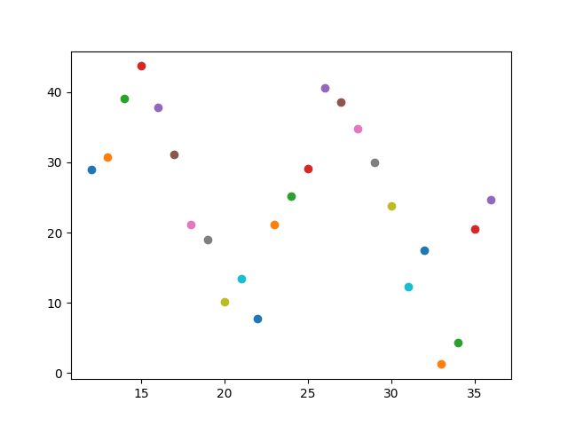
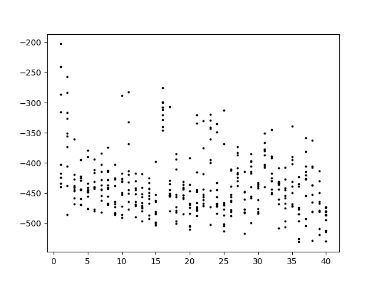
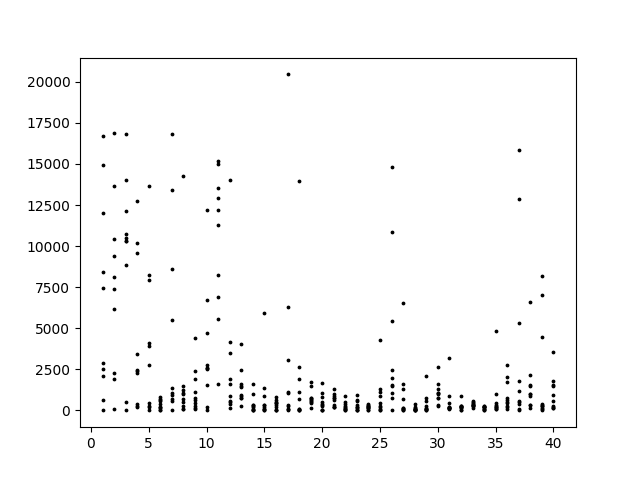
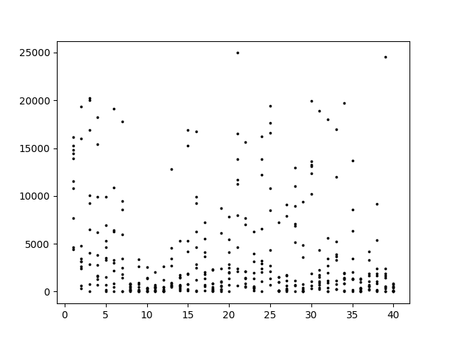
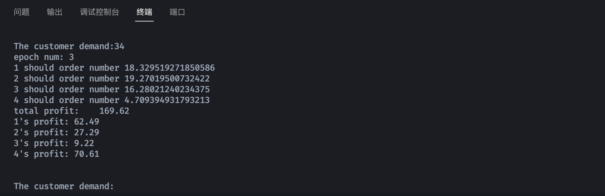

[![Contributors][contributors-shield]][contributors-url]
[![Forks][forks-shield]][forks-url]
[![Stargazers][stars-shield]][stars-url]
[![Issues][issues-shield]][issues-url]
[![MIT License][license-shield]][license-url]


<!-- PROJECT LOGO -->
<br />

<div align="center"  name="readme-top">
  <a href="https://github.com/kingwingfly/Supply-Chain-Decision-Model">
    
  </a>

  <h3 align="center">Supply Chain Decision Model</h3>

  <p align="center">
    A Neural Networks to Simulate Supply Chains using Python.
    <br />
    <a href="https://github.com/kingwingfly/Supply-Chain-Decision-Model"><strong>Explore the docs »</strong></a>
    <br />
    <br />
    <a href="https://github.com/kingwingfly/Supply-Chain-Decision-Model">View Demo</a>
    ·
    <a href="https://github.com/kingwingfly/Supply-Chain-Decision-Model/issues">Report Bug</a>
    ·
    <a href="https://github.com/kingwingfly/Supply-Chain-Decision-Model/issues">Request Feature</a>
  </p>
</div>


<!-- TABLE OF CONTENTS -->

<details>
  <summary>Table of Contents</summary>
  <ol>
    <li>
      <a href="#about-the-project">About The Project</a>
      <ul>
        <li><a href="#built-with">Built With</a></li>
      </ul>
    </li>
    <li>
      <a href="#getting-started">Getting Started</a>
      <ul>
        <li><a href="#prerequisites">Prerequisites</a></li>
        <li><a href="#quick-start">Quick Start</a></li>
        <li><a href="#predict">Predict</a></li>
      </ul>
    </li>
    <li><a href="#usage">Usage</a></li>
    <li><a href="#roadmap">Roadmap</a></li>
    <li><a href="#contributing">Contributing</a></li>
    <li><a href="#license">License</a></li>
    <li><a href="#contact">Contact</a></li>
    <li><a href="#acknowledgments">Acknowledgments</a></li>
  </ol>
</details>


<!-- ABOUT THE PROJECT -->
## About The Project

[![Product Architecture][architecture]](https://github.com/kingwingfly/Supply-Chain-Decision-Model/)

This is a Neural Networks to Simulate Supply Chains, helping **every role** in the supply chain to decide the order amount to maximize the benefits of the entire supply chain.


## Advantages

Here are advantages:
* Easy to use
* Low coupling, customizable

<p align="right">(<a href="#readme-top">back to top</a>)</p>


### Built With

* [![Python][PythonLogo]][Python-url]
* [![PyTorch][PytorchLogo]][Pytorch-url]

<p align="right">(<a href="#readme-top">back to top</a>)</p>


<!-- GETTING STARTED -->
## Getting Started

### Prerequisites

You need `python` below `3.11` over `3.8` installed.

Somehow, you need `pytorch2.0` with CUDA over `11.7`.

And maybe you need this [torch quick start](https://pytorch.org/get-started/locally/) for further infomation. 

### Quick Start

1. Clone the repo
   ```sh
   git clone https://github.com/kingwingfly/Supply-Chain-Decision-Model.git
   cd Supply-Chain-Decision-Model
   ```
2. Prepare the environment (only for those using conda, if you do not, solve by yourself)
   ```sh
   conda create -n torch python=3.10
   conda activate torch

   # then install torch

   pip install -r requirements.txt  # I did not test, solve by your self if things went wrong
   ```
3. start train or predict
   ```sh
   python train.py OR python predict.py
   ```

In order to maximize the profit, we use loss function:
```python
loss_fn = lambda: x: -x
```

Here's the loss image:


You can find the loss become more and more dispersed, while the average is greater. 
Considering the results, the purpose of optimizing decision-making is achieved.
Further, you could optimize the input (The data I test on is randomly uniform ditribution between 10 and 40) in more subtle way.

For example, I generated random demands based on the sine function with a period of 12 months.


And use the model trained previous as pretrained weights, the result is:


We can find the average profit is nearly 480.
So use MSELOSS to make the profit approach 480. The loss image is:

Although there is a shock, we only save the best state_dict. And train again based on it with greater target 500.
The loss image is:


Okay, the image looks not good. However, the model can really do something to some extent.

### Predict
Just set the model you want and run `predict.py`.
You can input something in the terminal:



<p align="right">(<a href="#readme-top">back to top</a>)</p>

<!-- ROADMAP -->
## Roadmap
- [ ] NONE

See the [open issues](https://github.com/kingwingfly/Supply-Chain-Decision-Model/issues) for a full list of proposed features (and known issues).

<p align="right">(<a href="#readme-top">back to top</a>)</p>

<!-- CONTRIBUTING -->
## Contributing

Contributions are what make the open source community such an amazing place to learn, inspire, and create. Any contributions you make are **greatly appreciated**.

If you have a suggestion that would make this better, please fork the repo and create a pull request. You can also simply open an issue with the tag "enhancement".
Don't forget to give the project a star! Thanks again!

1. Fork the Project
2. Create your Feature Branch (`git checkout -b feature/AmazingFeature`)
3. Commit your Changes (`git commit -m 'Add some AmazingFeature'`)
4. Push to the Branch (`git push origin feature/AmazingFeature`)
5. Open a Pull Request

<p align="right">(<a href="#readme-top">back to top</a>)</p>


LICENSE -->
## License

Distributed under the MIT License. See `LICENSE.txt` for more information.

<p align="right">(<a href="#readme-top">back to top</a>)</p>


<!-- CONTACT -->
## Contact

Louis - [@email](20200581@cqu.edu.cn) - 20200581@cqu.edu.cn

Project Link: [https://github.com/kingwingfly/Supply-Chain-Decision-Model](https://github.com/kingwingfly/Supply-Chain-Decision-Model)

<p align="right">(<a href="#readme-top">back to top</a>)</p>


<!-- ACKNOWLEDGMENTS -->
## Acknowledgments

Some document may help in develop tauri app and crawler.

* [Python Documentation](https://docs.python.org/3/)
* [Torch Tutorials](https://pytorch.org/tutorials/)

<p align="right">(<a href="#readme-top">back to top</a>)</p>


<!-- MARKDOWN LINKS & IMAGES -->
<!-- https://www.markdownguide.org/basic-syntax/#reference-style-links -->
[contributors-shield]: https://img.shields.io/github/contributors/kingwingfly/Supply-Chain-Decision-Model.svg?style=for-the-badge
[contributors-url]: https://github.com/kingwingfly/Supply-Chain-Decision-Model/graphs/contributors
[forks-shield]: https://img.shields.io/github/forks/kingwingfly/Supply-Chain-Decision-Model.svg?style=for-the-badge
[forks-url]: https://github.com/kingwingfly/Supply-Chain-Decision-Model/network/members
[stars-shield]: https://img.shields.io/github/stars/kingwingfly/Supply-Chain-Decision-Model.svg?style=for-the-badge
[stars-url]: https://github.com/kingwingfly/Supply-Chain-Decision-Model/stargazers
[issues-shield]: https://img.shields.io/github/issues/kingwingfly/Supply-Chain-Decision-Model.svg?style=for-the-badge
[issues-url]: https://github.com/kingwingfly/Supply-Chain-Decision-Model/issues
[license-shield]: https://img.shields.io/github/license/kingwingfly/Supply-Chain-Decision-Model.svg?style=for-the-badge
[license-url]: https://github.com/kingwingfly/Supply-Chain-Decision-Model/blob/master/LICENSE.txt
[linkedin-shield]: https://img.shields.io/badge/-LinkedIn-black.svg?style=for-the-badge&logo=linkedin&colorB=555
[linkedin-url]: https://linkedin.com/in/othneildrew
[product-screenshot]: static/screenshot.png
[architecture]: static/architecture.png
[PythonLogo]: static/python_logo.png
[Python-url]: https://www.python.org/
[PytorchLogo]: static/pytorch_logo.png
[Pytorch-url]:https://pytorch.org/
****